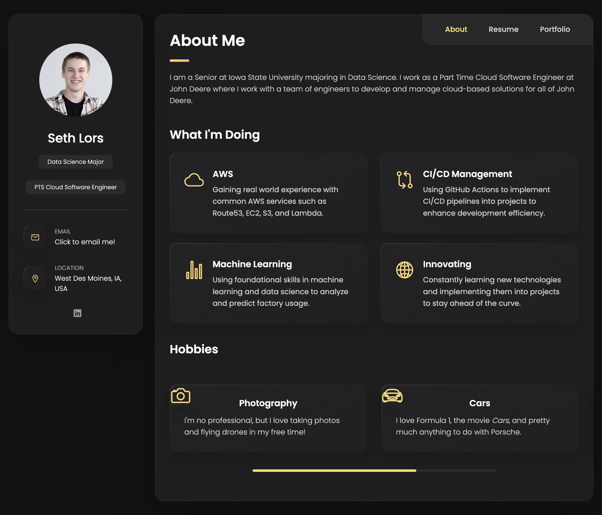

### Personal Portfolio

 

I built this to both showcase my work and to learn a little bit of web development

Some of the key features I have implemented are:

- Responsive Design: The website is designed to be responsive and can adapt to different screen sizes, making it
  accessible on desktops, laptops, tablets, and mobile devices.
- Interactive UI: The website includes interactive elements such as a sidebar and modal windows, providing a dynamic
  user experience.
- Filterable Portfolio: The portfolio section of the website allows users to filter projects by category, making it easy
  to find relevant work samples.
- Animated Skill Bars: The skills section of the website includes animated progress bars that visualize proficiency
  levels in various skills.

Future updates may include:

- Contact form that allows users to send messages directly from the website and store them in a database.

This code was modified from a template by [codeswithadee](https://github.com/codewithsadee/vcard-personal-portfolio.git)
with the main changes made by me being animations and a few design tweaks.